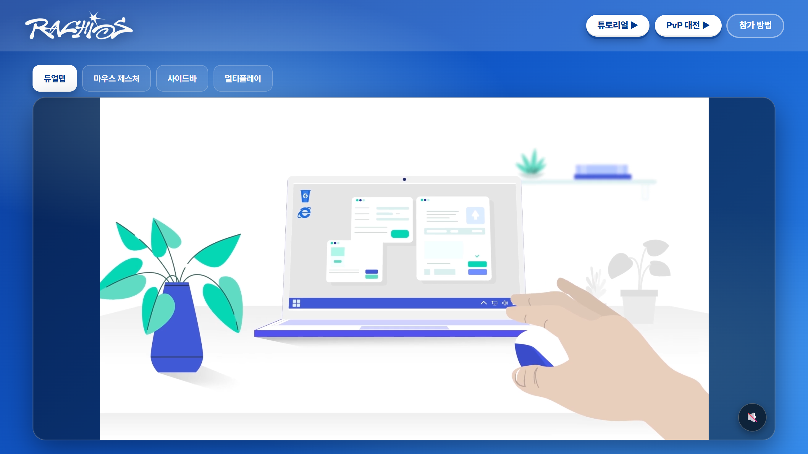
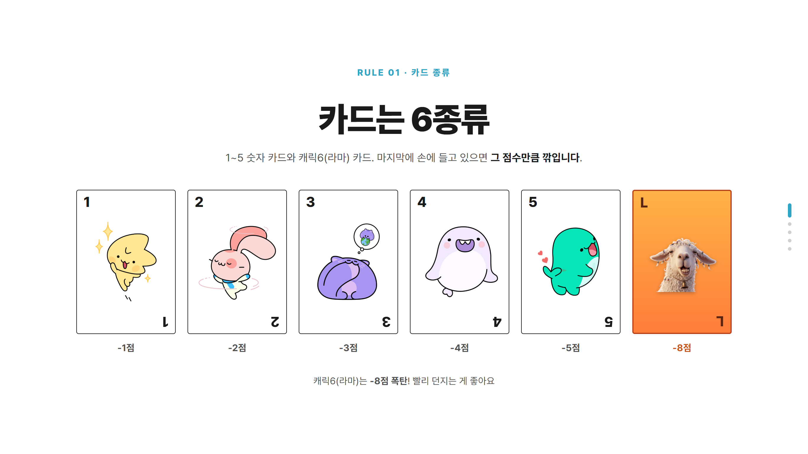
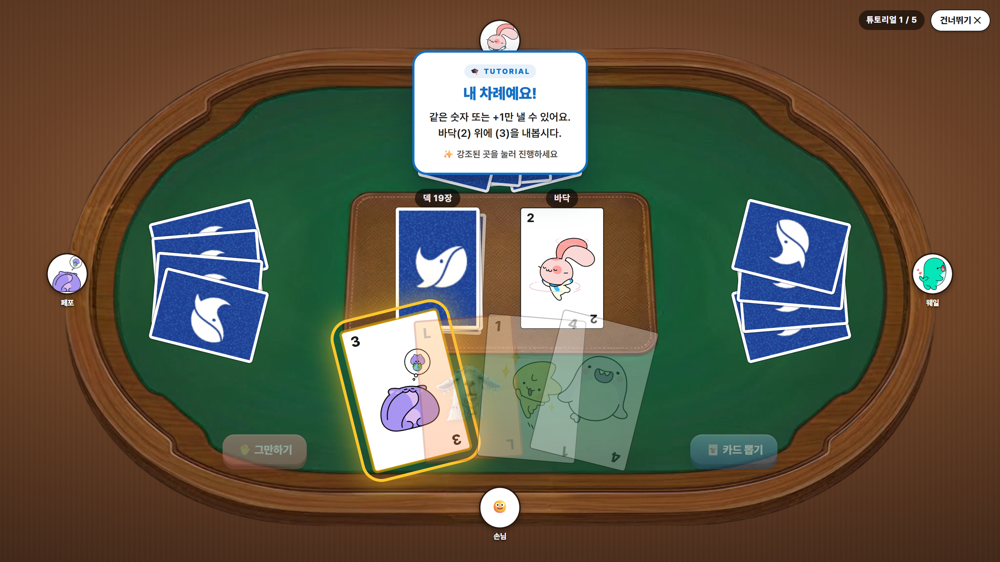
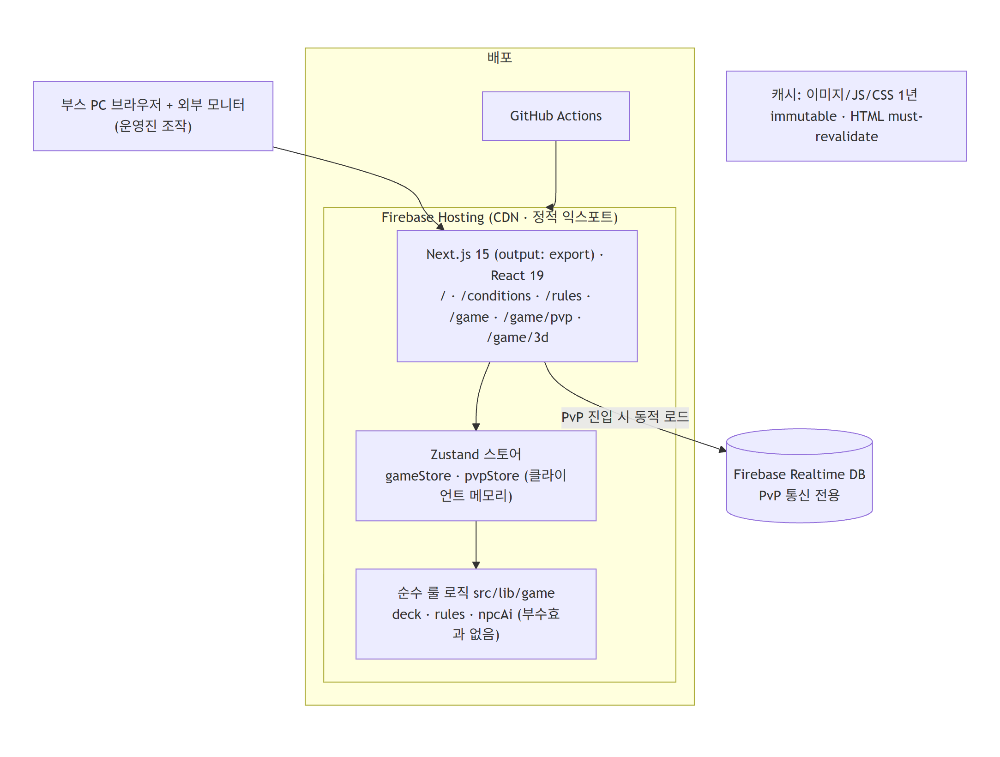
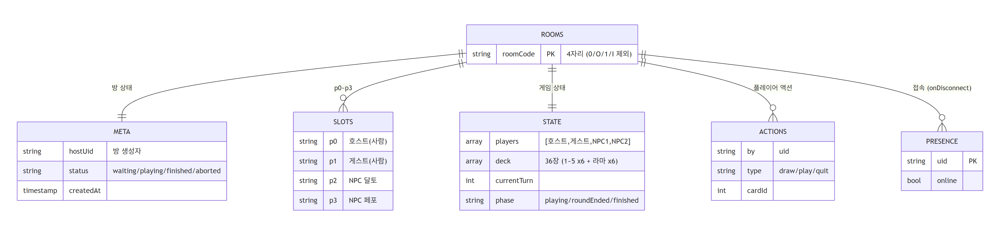

# 네이버 웨일 캠퍼스크루 부스 게임

> 한양대 축제 부스에서 네이버 웨일을 홍보하는 **온·오프라인 연계 카드게임 웹앱**

<div align="center">




**Live**: <https://naver-whale-campus-crew.web.app>

</div>

---

## 1. 프로젝트 개요

부스 단말에서 네이버 웨일의 핵심 기능(웨일 스페이스·웨일온·사이드바) 인지를 높이고 추천인 코드 등록 전환을 유도하려면, 손님이 부스에 머무를 이유가 필요했다. 그래서 QR 스캔 → 추천인 코드 등록 → 부스 PC에서 웨일프렌즈 NPC들과 카드게임 한 판 → 등수에 따른 상품 수령으로 이어지는 흐름을 설계했다. 운영 환경은 **부스 PC 1대 + 외부 모니터**로 제한되고 손님은 구두로 카드를 고르면 운영진이 클릭하는 방식이라, 외부 의존을 최소화한 **정적 익스포트 + CDN 배포**로 부스 네트워크 불안정성에 대비했다.

<table>
<tr>
<td></td>
<td></td>
</tr>
</table>

## 2. 주요 기능 (기술적 난이도 중심)

### 🃏 부스 우호도를 보장하는 NPC AI 휴리스틱
손님 1·2·3등 비율 ≥ 75%를 달성하면서도 NPC가 실제로 룰을 따르도록, 손패 크기·점수 손실에 따라 quit 확률을 동적으로 조정하고 "큰 손실을 굳히는 quit"를 차단해 NPC가 더 뽑게 유도한다. 동일 로직을 쓰되 Phase 1 상대(HYLION)는 30% 실수율을 추가해 난이도를 조절한다.

### 🔄 PvP 실시간 동기화 (Firebase RTDB)
노트북 2대 간 게임 상태를 **호스트 단일 권한 모델**로 동기화해 NPC 의사결정(`Math.random`)의 재현성을 보장한다. 4자리 방 코드를 transaction으로 원자적 매칭하고, presence `onDisconnect` + 30초 grace abort로 호스트 이탈에 대응한다.

### 🧱 정적 익스포트 + Phase 2 확장 구조
Next.js `output: 'export'`로 정적 빌드만 쓰면서도, Phase 2의 three.js 3D 모드를 `/game/3d/` 별도 라우트로 분리해 2D를 폴백으로 유지한다. Firebase 패키지도 PvP 진입 시에만 동적 로드해 초기 번들을 가볍게 했다.

## 3. 시스템 아키텍처

게임 로직은 전부 클라이언트에서 돈다. 순수 룰 함수(`src/lib/game`)를 Zustand 스토어가 구동하고, 정적 빌드는 Firebase Hosting CDN에 배포된다. PvP일 때만 Firebase Realtime Database로 두 단말을 잇는다.



## 4. 데이터 모델 (Firebase RTDB)

별도 RDB 없이 모든 게임 상태는 클라이언트 인메모리이며, PvP만 RTDB의 `rooms/{code}` 트리를 공유한다. `meta`(방 상태) · `slots`(p0~p3) · `state`(덱·턴·페이즈) · `actions`(플레이어 액션 큐) · `presence`(접속)로 구성된다.



## 5. 기술적 의사결정

| 결정 | 선택 | 왜 |
|---|---|---|
| 렌더링 | **Next.js 정적 익스포트** | 부스 PC 1대 — SSR/DB/Auth 불필요. CDN 캐싱으로 네트워크 불안정 대비 + Phase 2 3D 확장 용이 |
| 상태 관리 | **Zustand** (단일 스토어) | 게임 흐름·NPC 턴 스케줄링(setTimeout)에 충분, Redux 오버헤드 불필요 |
| PvP 통신 | **Firebase Hosting + RTDB** | Spark 무료 한도로 부스 운영 충분, WebSocket/WebRTC 직접 구현보다 운영 부담 최소 |
| PvP 권위 | **호스트 단일 권한** | `Math.random` 단일 출처로 NPC 의사결정 재현성 보장 (부정행위는 운영진 통제로 수용) |
| 테스트 | **Vitest** (룰 함수) + Playwright(시각) | 순수 룰 함수의 정확성만 단위 테스트, E2E 대신 시각 캡처로 검증 |
| CI/CD | **GitHub Actions** | `main` push 시 자동 빌드·배포 — 운영진이 직접 `firebase deploy` 불필요 |

---

### 로컬 실행 (요약)

```bash
pnpm install
pnpm dev          # http://localhost:3000
pnpm test:run     # 룰/AI 단위 테스트
pnpm deploy       # build + firebase deploy (project: naver-whale-campus-crew)
```

> 운영 설정: 추천인 코드는 `src/lib/config.ts`의 `REFERRAL_CODE` 한 줄, NPC는 `src/lib/game/data.ts`.

### 문서

[`docs/PRD.md`](docs/PRD.md) · [`docs/ARCHITECTURE.md`](docs/ARCHITECTURE.md) · [`docs/game-rules.md`](docs/game-rules.md) · [`docs/booth-operations.md`](docs/booth-operations.md) · [`docs/adr/`](docs/adr/)
